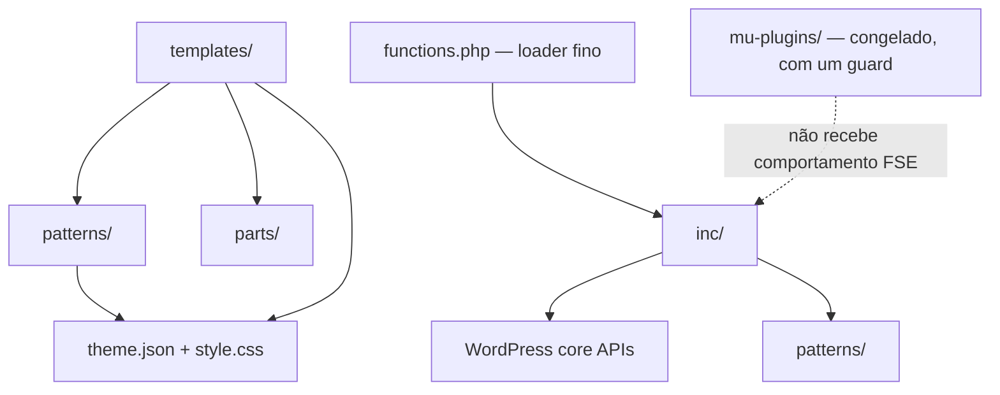
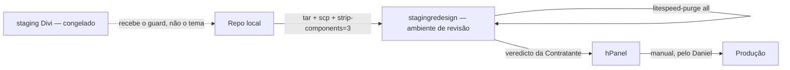
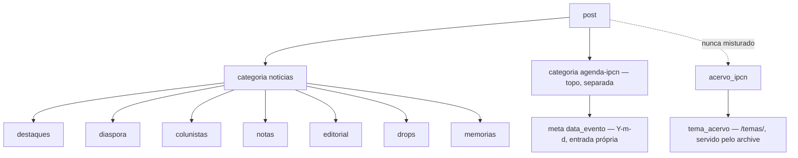

# Architecture Spine — IPCN, site público

## Design Paradigm

**Block-first sobre o WordPress FSE.** O markup é block markup, escrito em ficheiros, não fabricado em strings PHP. O PHP existe para o que os blocos não exprimem: registar, consultar, enviar correio, enfileirar.

Camadas, e quem pode depender de quem:



- `templates/` — a estrutura de cada superfície, em block markup.
- `patterns/` — markup reutilizável, incluindo o cartão. Registado no `init`.
- `parts/` — header e footer.
- `inc/` — comportamento, um ficheiro por preocupação.
- `functions.php` — carrega `inc/`. Não acumula lógica.
- `theme.json` e `style.css` — tokens e regras visuais.
- `mu-plugins/` — transversal e congelado. Não é superfície deste trabalho, com uma excepção autorizada em AD-6.

Fronteira que o paradigma impõe, e que é fácil errar: um pattern é registado no `init` e o seu corpo é compilado sem que a query ou o post existam. **PHP dentro de um pattern não vê o loop.** Listar conteúdo é `core/query`, que o WordPress renderiza mais tarde.

## Invariants & Rules

### AD-1 — O markup é block markup, nunca texto escrito à mão em PHP

- **Binds:** all
- **Prevents:** Duas fontes de verdade para o markup; e a classe de defeito em que block markup é impresso como texto e o browser o descarta.
- **Rule:** PHP não escreve comentários de bloco como literais. O markup é escrito em `templates/*.html` ou `patterns/*.php`.
  Duas excepções, e só estas:
  1. PHP pode obter o markup de um **pattern registado** e entregá-lo ao API de blocos (`do_blocks()` ou `render_block()`) para ser interpretado. O que é proibido é o literal escrito à mão, não a passagem pelo interpretador.
  2. Um `render_callback` de um bloco registado pode imprimir elementos HTML com as classes do tema. Não pode imprimir comentários de bloco.

### AD-2 — Listar conteúdo é `core/query`; PHP só quando o `core/query` não chega

- **Binds:** FR-1, FR-2, FR-4, FR-5
- **Prevents:** Quatro mecanismos de listagem a divergir — `wp:query` na Home, shortcode nas internas, `inherit` no archive, e a janela da agenda.
- **Rule:** Uma listagem que filtra por tipo de conteúdo, categoria ou taxonomia é um `core/query`, ou o `core/query` herdado do archive. Só quando o filtro exige comparação de meta ou de data é que passa a bloco dinâmico (AD-9). Não se cria `WP_Query` novo em shortcodes.

### AD-3 — O cartão é um pattern registado, com as casas fixadas

- **Binds:** FR-2, FR-4, FR-6
- **Prevents:** Três implementações de cartão a divergir — `ipcn-card` no shortcode, `ipcn-card-v2` nos blocos, e a da agenda, que não renderiza — e duas unidades a discordarem sobre o que um cartão contém.
- **Rule:** Existem exactamente dois: `patterns/ipcn-card.php` e `patterns/ipcn-card-feature.php`, registados com `Inserter: false`. Todas as listagens renderizam por um deles. As casas são estas e nenhuma outra:

  | Casa | `ipcn-card` | `ipcn-card-feature` |
  | --- | --- | --- |
  | Imagem | 16:9, recortada | 4:3, recortada |
  | Sem imagem | marcador tipográfico `IPCN` | marcador tipográfico `IPCN` |
  | Etiqueta | `category` em Notícias, Secção e Home; `tema_acervo` no Acervo e no Tema | igual |
  | Título | escala de cartão | escala de headline |
  | Data | data de publicação, excepto na agenda (AD-9) | data de publicação |

  O marcador de ausência de imagem é obrigatório: `core/post-featured-image` devolve string vazia, não um elemento, e sem o marcador o cartão encolhe. O elemento é um `span` com a classe `ipcn-card-noimg` — a mesma para que `style.css` já reserva altura.
  O contrato de classes do cartão é `.ipcn-card`, `.ipcn-card-media`, `.ipcn-card-noimg`, `.ipcn-card-title`, `.ipcn-card-date`. `.ipcn-card-v2` está retirada: nenhum markup novo a usa, e as suas regras saem de `style.css` quando as listagens migrarem.

### AD-4 — O comportamento vive em `inc/`; `functions.php` é um carregador

- **Binds:** all
- **Prevents:** Um ficheiro a crescer sem limite, com seis responsabilidades e sem um único `include`.
- **Rule:** Comportamento novo entra num ficheiro de preocupação em `inc/`: `setup.php`, `content-model.php`, `listings.php`, `forms.php`, `cookie-bar.php`, `agenda-block.php`. `functions.php` carrega-os e não contém lógica própria. Nenhum ficheiro de `inc/` regista o mesmo hook que outro.

### AD-5 — O CSS do tema vive só em `style.css`

- **Binds:** FR-11, FR-12, FR-13
- **Prevents:** CSS em quatro sítios — `style.css`, um `wp_add_inline_style` e três blocos `<style>` no `wp_head` a partir do mu-plugin.
- **Rule:** Nenhum PHP do **tema** emite `<style>`. A única excepção é a propriedade personalizada `--ipcn-hero-bg`, derivada do caminho do asset do tema. As regras visuais ficam em `style.css`; os tokens em `theme.json`. O que o mu-plugin emite é tratado em AD-6.

### AD-6 — O mu-plugin é congelado, com um guard autorizado

- **Binds:** wp-content/mu-plugins/
- **Prevents:** Partir o staging Divi, que está congelado; e o site FSE a receber CSS Divi que não usa, incluindo um `@font-face` que aponta para ficheiros inexistentes.
- **Rule:** Não se acrescenta lógica FSE ao mu-plugin, não se divide, e não se faz deploy dele numa alteração só de tema.
  **Excepção autorizada (24/09):** os três blocos só-Divi que ele emite no `wp_head` — `#ipcn-etmodules-fix`, `#ipcn-form-style`, `#ipcn-footer-logo-fix` — passam a ser emitidos apenas quando o tema activo é o Divi. No Divi o comportamento fica idêntico. Nada mais no ficheiro muda.

### AD-7 — A selecção de conteúdo é por slug; ids de conteúdo não são código

- **Binds:** all
- **Prevents:** Ruptura entre ambientes — o `term_id` muda entre a base de dados do redesign, a do Divi e a de produção.
- **Rule:** Consultas de categoria e taxonomia filtram por slug: `category_name` e `categoryName` com slug, nunca `term_id`. Isto vale para a selecção de conteúdo.
  Identificadores que **são** conteúdo na base de dados — a referência da navegação no cabeçalho e os ids de páginas nos links do rodapé — não se convertem em slug, e mudam-se na base de dados, não no tema.

### AD-8 — O modelo de conteúdo: Secções são filhas de `noticias`; Agenda é categoria de topo; Acervo é tipo próprio

- **Binds:** FR-1, FR-2, FR-4, FR-5, FR-6
- **Prevents:** Uma Secção nova a nascer como categoria de topo ou como CPT; o Acervo a misturar-se com `post`; e dois construtores a discordarem sobre que template serve o quê.
- **Rule:** Uma Secção nova é categoria filha de `noticias` e o seu texto de apresentação vive na descrição do termo. `agenda-ipcn` é categoria de topo, não filha de `noticias`. `acervo_ipcn` e `tema_acervo` (rewrite em `/temas/`) mantêm-se separados de `post`, e uma consulta ao Acervo nunca inclui `post`.
  Superfícies: `/temas/<slug>` é servido deliberadamente pelo template do archive, com o hero a ler a descrição do termo. A Agenda é uma página cujo conteúdo é um único bloco `ipcn/agenda`, e o archive da categoria `agenda-ipcn` redirecciona para essa página — não é superfície pública nem indexável, e nunca lista encontros passados como próximos.

### AD-9 — A Agenda é um bloco dinâmico registado no servidor

- **Binds:** FR-6, FR-7
- **Prevents:** Fabricar block markup em PHP — o defeito actual, em que os cartões da agenda renderizam vazios — e tentar exprimir uma janela temporal no `core/query`, que não tem `meta_query` nem `date_query`.
- **Rule:** O bloco da agenda corre a sua própria consulta em tempo de render e renderiza pelo cartão compacto.
  A data de um encontro é **só** `data_evento`. Um encontro sem `data_evento` preenchido não aparece como próximo — cai no estado vazio. Não há alternativa pela `post_date`, nem por poste nem por consulta.
  O bloco chama-se `ipcn/agenda` e tem um único atributo, `limite`, inteiro, por omissão `3`. A secção da Home usa `limite: 3`; a página da Agenda usa `limite: -1`, todos os encontros por vir. A ordem é crescente por data. É o único lugar em que o tema corre a sua própria consulta.

### AD-10 — A data do evento é um campo registado pelo tema, com entrada própria

- **Binds:** FR-6, FR-7
- **Prevents:** Erro de formato a deixar a agenda silenciosamente vazia; e a cliente a ter de escrever uma meta key à mão.
- **Rule:** O tema regista `data_evento` como meta de `post`, e dá-lhe **entrada própria**: uma caixa de meta em PHP com um campo `input type="date"`, que traz o selector de data do browser. Não se usa o painel de campos personalizados crus. O valor é guardado em `Y-m-d` e validado ao guardar; qualquer outro formato é rejeitado e não é gravado.
  Registar a meta não cria campo nenhum no editor — é a caixa de meta que o cria.

### AD-11 — Formulários: sem nonce, honeypot mais origem, e as peças nomeadas

- **Binds:** FR-8, FR-9
- **Prevents:** Deriva entre handler, campos, argumento de redirect e mensagem — duas unidades a usar `nome` e `ipcn_nome` faz com que **todas** as submissões caiam num erro legítimo e silencioso; e protecção documentada que não existe, porque o comentário promete verificação de referer e não há nenhuma.
- **Rule:** As peças são estas, e as duas pontas concordam nelas:

  | Peça | Valor |
  | --- | --- |
  | Acção | `ipcn_assoc`, `ipcn_contact` |
  | Campos | `ipcn_nome`, `ipcn_email`, `ipcn_tel`, `ipcn_msg`, `ipcn_hp` (honeypot) |
  | Redirect | `/associe-se/` com `cadastro`, `/fale-conosco/` com `contato` |
  | Valores | `ok`, `erro` |
  | Destino | `contato@ipcnbrasil.org` |

  Não há nonce: o LiteSpeed serve HTML em cache e um nonce em página cacheada quebra o formulário. A protecção é o honeypot mais uma verificação de origem ou referer, que não guarda estado no servidor. A regra da verificação: se `Origin` ou `Referer` vier presente e não corresponder ao host do site, a submissão é rejeitada; se vierem **ambos ausentes** — o que acontece legitimamente quando uma política de privacidade do browser os retira — a submissão é aceite e fica só com o honeypot. Bloquear pessoas reais é pior do que um filtro de bots ligeiramente mais fraco.
  Retenção: ao rejeitar, o handler guarda os valores submetidos num transient de vida curta, indexado por um token que vai no URL do redirect. O pattern do formulário lê o token, re-preenche os campos, escreve um resumo de erro no topo, liga cada erro ao campo por `aria-invalid` e `aria-describedby`, e apaga o transient. Sem isto, o redirect perde os valores e o FR-8 não é cumprido.

### AD-12 — O deploy é manual e só o ambiente de revisão é destino

- **Binds:** FR-17, FR-18
- **Prevents:** Aparecer um pipeline para produção, ou uma alteração cair no staging Divi congelado.
- **Rule:** O deploy é para `stagingredesign`: tar, scp, `tar -xzf --strip-components=3` no tema, e `litespeed-purge all`. A produção é publicada pelo Daniel no hPanel, depois do veredicto da Contratante. Nenhum artefacto deste repo publica em produção. O mu-plugin só se deploya quando ele próprio muda, e nunca para o staging Divi.

### AD-13 — A verificação é sintaxe mais browser, depois da purga

- **Binds:** all
- **Prevents:** Tratar HTML em cache como verdade, e duas pessoas a verificar de formas diferentes.
- **Rule:** Script no repo corre `php -l` em todo o PHP alterado e falha se algum não compilar. A verificação visual é no browser, em `stagingredesign`, depois de purgar a cache e com `?nocache=1`. Não há suite de testes nem CI.
  Nota: este script apanha erros de sintaxe, não as duas classes de defeito que este projeto já produziu — block markup impresso como texto e um cartão a encolher por falta do marcador. Essas verificam-se no browser.

### AD-14 — O cartão tem um caminho de render, e é só um

- **Binds:** FR-2, FR-4, FR-6
- **Prevents:** O cartão a ser construído de três formas legais — dentro de `core/post-template`, por `do_blocks()` no bloco da agenda, e por HTML à mão — sendo duas delas a repetição do defeito que o AD-9 existe para impedir.
- **Rule:** Nas listagens, o cartão é usado **dentro** de `core/post-template`, e o contexto do post vem do próprio loop. Fora de um loop — só a agenda — o bloco dinâmico renderiza o cartão chamando `render_block()` com o `postId` no contexto, a partir do pattern registado. Nenhum caminho escreve markup de cartão à mão.
  Consequência a respeitar: um render que não fixe o contexto do post renderiza o título da própria página, e falha em silêncio com aspecto plausível.

### AD-15 — A vitrine do Acervo é duas consultas com números fixados

- **Binds:** FR-2
- **Prevents:** "Uma peça em destaque e duas secundárias" a ser tentado com CSS sobre uma grelha única, deixando o cartão de destaque sem uso na única superfície que o AD-3 lhe atribui.
- **Rule:** A vitrine do Acervo na Home são dois `core/query` irmãos: um com `perPage: 1` para o `ipcn-card-feature`, outro com `perPage: 2` e `offset: 1` para dois `ipcn-card`, ambos ordenados por data decrescente. Os números não se improvisam.

## Consistency Conventions

| Concern | Convention |
| --- | --- |
| Naming | Patterns `ipcn/<nome>`; ficheiros de `inc/` pela preocupação; classes CSS `ipcn-*`; hooks, handlers e shortcodes `ipcn_*`; meta `data_evento`; honeypot `ipcn_hp`; propriedade CSS `--ipcn-hero-bg`. |
| Data & formats | Datas de meta em `Y-m-d`; datas mostradas em `j \d\e M \d\e Y`; filtros sempre por slug; paginação em `/page/N/`; feedback de formulário por argumento de consulta. |
| State & cross-cutting | Consentimento em `localStorage['ipcn_cookie_consent_v1']`, com o objecto `{ts, necessary, analytics, marketing, all}`; todo o correio vai para `contato@ipcnbrasil.org`, com o From forçado pelo mu-plugin; erro identificado por texto além da cor; tokens visuais em `theme.json`, regras visuais em `style.css`. |

## Stack

| Name | Version |
| --- | --- |
| WordPress | >= 6.4 declarado no tema (piso seguro para as APIs usadas); 7.1 corrente à data da escrita |
| PHP | >= 8.1 declarado no tema; note-se que 8.1 saiu de suporte em 2025-12-31 e o WordPress 7.1 recomenda 8.3+ |
| Tema | `ipcn-fse` 0.2.0, block theme, sem build step |
| Google Fonts | externo, enfileirado em PHP |

## Structural Seed

Estrutura pretendida do tema:

```text
wp-content/themes/ipcn-fse/
  functions.php        # carregador fino, sem lógica
  inc/
    setup.php          # enqueue, fontes, preconnect
    content-model.php  # CPT acervo_ipcn, taxonomia tema_acervo, meta data_evento e a sua caixa
    listings.php       # hero de arquivo, helpers de consulta
    forms.php          # handlers, honeypot, origem, transient de retenção
    cookie-bar.php     # barra e painel de cookies
    agenda-block.php   # bloco dinâmico da agenda
  patterns/
    ipcn-card.php
    ipcn-card-feature.php
  templates/           # front-page, single, page, archive, archive-acervo_ipcn, single-acervo_ipcn, index, 404
  parts/               # header, footer
  assets/              # hero-bg.jpg
  theme.json
  style.css
wp-content/mu-plugins/ # congelado, com o guard do AD-6
  ipcn-optimizations.php
  ipcn-mail-from.php
```

Ambientes:



Modelo de conteúdo:



## Capability → Architecture Map

| Capability | Lives in | Governed by |
| --- | --- | --- |
| FR-1, FR-2, FR-3 Home e Notícias | `templates/front-page.html`, `templates/single.html`, `patterns/` | AD-1, AD-2, AD-3, AD-14, AD-15 |
| FR-4 Acervo e Temas | `templates/archive-acervo_ipcn.html`, `templates/single-acervo_ipcn.html`, `inc/content-model.php`, `templates/archive.html` para `/temas/` | AD-1, AD-2, AD-7, AD-8 |
| FR-5 Secções e menu | `templates/archive.html`, `inc/listings.php`, navegação na BD | AD-2, AD-7, AD-8 |
| FR-6, FR-7 Agenda, Home e página | `inc/agenda-block.php`, `inc/content-model.php` | AD-9, AD-10, AD-14 |
| FR-8, FR-9 Formulários | `inc/forms.php`, pattern do formulário | AD-11 |
| FR-10 Apoia-se | conteúdo da página, `assets/` | AD-1 |
| FR-11 Cookies | `inc/cookie-bar.php` | AD-4, AD-5 |
| FR-12, FR-13 Identidade, acessibilidade, telemóvel | `theme.json`, `style.css` | AD-5 |
| FR-17, FR-18 Gate e produção | envelope operacional | AD-12, AD-13 |

## Deferred

- **Papéis e fluxo de aprovação da fase seguinte** (FR-14 a FR-16). Fora do âmbito desta espinha, por decisão. Duas questões a fechar antes de a desenhar: como é que um administrador edita itens do Acervo hoje, dado que o CPT declara `capability_type => acervo` com `map_meta_cap` e nenhuma role define essas capabilities; e se as capabilities vivem no tema ou num plugin.
- **Script de editor para o bloco da agenda.** O WordPress 7.0 introduziu `supports: autoRegister`, que regista blocos só-PHP no editor com JS gerado — a limitação deixa de ser inevitável. Reabrir quando a contratante precisar de o mover sozinha. Nesta entrega o bloco é usado em template, não no inseridor.
- **Remoção das três implementações de cartão actuais** e dos shortcodes de markup. Faz parte das histórias, não desta espinha.
- **Busca.** Não-objetivo declarado no PRD.
- **O `Tested up to: 6.6` do tema** está desactualizado face ao WordPress 7.x. Actualizar quando se tocar no cabeçalho do tema.
- **Migração do legado para o Acervo**, e **detalhe do orçamento de desempenho** (Lighthouse ≥ 90 em mobile).
- **Alternativa ao bloco da agenda:** `query_loop_block_query_vars` poderia injectar a comparação de meta num `core/query` no front end. Não se segue: resolve a listagem mas não a entrada da data, e deixa o editor a mostrar uma pré-visualização que não corresponde.
